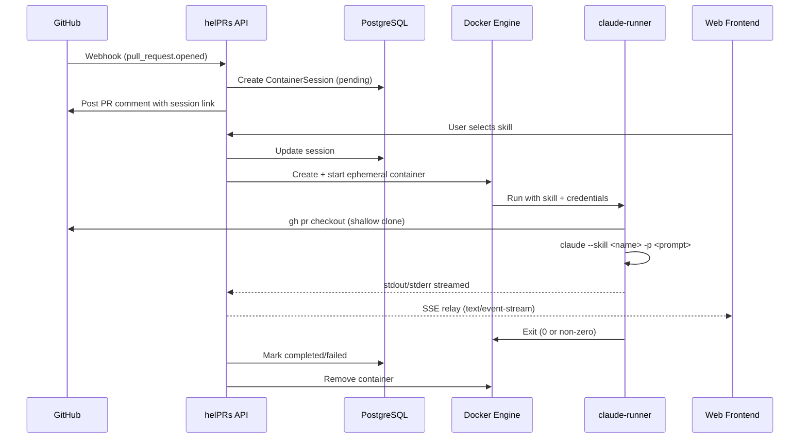

# helPRs -- Project Status

> Last updated: 2026-04-17

---

## 1. Project Overview

helPRs is a pluggable AI skill runner for pull requests. When a PR is opened on a GitHub repository with the helPRs GitHub App installed, the backend spins up an ephemeral Docker container running Claude Code CLI, executes a user-selected skill (comprehension quiz, code review, security audit, etc.) against the PR, and streams results back to a web UI in real time via Server-Sent Events (SSE). The AI execution happens entirely inside short-lived containers -- the backend never calls the Claude API directly.

**Value proposition:** Give engineering teams an AI-powered PR companion that goes beyond linting -- think Socratic quizzes to verify the author actually understands their changes, multi-layer adversarial code reviews, and targeted security audits. Skills are pluggable and community-contributable.

**Target users:** Development teams, starting with papernest as the internal pilot. Designed for open-source release with a BYOK (Bring Your Own Key) model: users provide their own Anthropic API key, stored encrypted, and injected into containers at runtime.

**Business model:** Open-source, self-hosted. No billing module, no SaaS tier. Users supply their own Claude credentials.

---

## 2. Architecture

### High-level flow



### Backend modules

| Module | Path | Purpose |
|--------|------|---------|
| **core** | `apps/api/src/helprs/core/` | Config, database engine, dependencies, exceptions, middleware (CORS, rate limiting, structured logging), Fernet encryption, JWT security |
| **identity** | `apps/api/src/helprs/modules/identity/` | GitHub OAuth flow, user creation/lookup, JWT token minting |
| **installation** | `apps/api/src/helprs/modules/installation/` | GitHub App installation lifecycle, BYOK credential storage (Fernet-encrypted), installation token minting, PR comment posting |
| **webhook** | `apps/api/src/helprs/modules/webhook/` | Webhook signature verification, event dispatch, persistent event storage, crash-recovery replay, periodic reaper |
| **container** | `apps/api/src/helprs/modules/container/` | Container session CRUD, Docker lifecycle (create/start/stop/remove), SSE log streaming, TTL-based cleanup |
| **admin** | `apps/api/src/helprs/admin/` | SQLAdmin panel at `/admin` for credential management |
| **comprehension** | `apps/api/src/helprs/modules/comprehension/` | Pre-pivot DDD module (empty -- only `__pycache__` remains) |
| **billing** | `apps/api/src/helprs/modules/billing/` | Removed per open-source pivot (empty -- only `__pycache__` remains) |

### Frontend features

| Feature | Path | Purpose |
|---------|------|---------|
| **auth** | `apps/web/src/features/auth/` | OAuth callback handler, protected route wrapper, Zustand auth store |
| **landing** | `apps/web/src/features/landing/` | Landing page with GitHub App install CTA |
| **installation** | `apps/web/src/features/installation/` | Post-install setup flow (SetupView) and settings management (SettingsView) |
| **session** | `apps/web/src/features/session/` | Skill selection UI (SkillSelector), container session management (ContainerSession), terminal output renderer (TerminalOutput), plus pre-pivot components (ChatPanel, ChatView, ScoreCard, etc.) |
| **shared** | `apps/web/src/shared/` | SSE parser hook (`useSSE`), reduced-motion hook, viewport hook, theme tokens |

### Skills system

Skills are self-contained agent definitions stored in `skills/`. Each skill folder contains exactly three files:

- `CLAUDE.md` -- instructions Claude Code reads when entering the skill directory
- `prompt.md` -- prompt template with `{{PLACEHOLDER}}` variables filled by the orchestrator
- `config.yaml` -- metadata (name, fetch strategy, duration estimate, output format)

Skills are mounted read-only into ephemeral containers via Docker volume binds.

### Infrastructure

- **Docker Compose**: API (:8000), Web (:5173), PostgreSQL 16 (:5432)
- **claude-runner**: Node 20-slim base image with `gh` CLI + `@anthropic-ai/claude-code` npm package
- **CI**: GitHub Actions -- lint (ruff, eslint), test (pytest with Postgres service, vitest), on all branches
- **CD**: GitHub Actions deploy workflow, Docker images via GHCR, deployed to Coolify

---

## 3. What's Built

### Backend (35 source files, 25 test files)

**Core infrastructure** -- stable, tested:
- App factory with async lifespan managing DB engine (`apps/api/src/helprs/main.py`)
- Async SQLAlchemy with `asyncpg`, session factory pattern
- Fernet encryption for credential storage at rest
- JWT-based auth with GitHub OAuth
- Structured logging via `structlog`, Sentry integration
- Rate limiting via `slowapi`
- CORS middleware
- 7 core tests (config, database, dependencies, exceptions, logging, middleware, security)

**Identity module** -- stable, tested:
- GitHub OAuth flow (authorization URL, token exchange, user creation)
- JWT access token minting
- 2 test files (router, service)

**Installation module** -- stable, tested:
- GitHub App installation lifecycle (create, soft-delete, suspend, unsuspend)
- BYOK credential storage (Fernet-encrypted Anthropic API keys)
- Installation access token minting via GitHub API
- PR comment posting with retry logic
- 4 test files (router, service, BYOK router, BYOK service, suppression service)

**Webhook module** -- stable, tested:
- HMAC-SHA256 signature verification
- Event dispatcher routing by event type + action
- Persistent webhook event storage for crash recovery
- Replay system: boot-time replay + periodic reaper (5-minute interval)
- PR opened handler: creates container session + posts PR comment with session link
- 5 test files (dispatcher, handlers, repository, replay, router, verification)

**Container module** -- new, tested (no real Docker integration yet):
- `ContainerSession` ORM model with status enum (pending/running/completed/failed/timeout)
- `DockerClient` protocol + `AioDockerClient` production implementation (aiodocker)
- Session CRUD: create, get, get-or-404
- Container lifecycle: start (pending -> running), stop, mark-completed, cleanup-expired
- SSE log streaming via async generator
- REST endpoints: POST create, GET status, GET stream (SSE), POST stop
- Resource limits: 512MB memory, 1 CPU, 15-minute TTL
- 3 test files + 1 integration test (service, router, models, container flow)

**Alembic migrations** -- 10 migration files:
- `github_users`, `installations`, `webhook_events`, `sessions`
- `byok_configs`, `suppression` (installation settings)
- `questions`, `answers`, `scores`, `reports_and_feedback` (pre-pivot, may need cleanup)
- `container_sessions` (new)

### Frontend (42 source files, 23 test files)

**Auth flow** -- stable:
- `OAuthCallback.tsx` -- handles GitHub OAuth redirect, exchanges code for token
- `ProtectedRoute.tsx` -- guards authenticated routes
- `store.ts` -- Zustand auth store (access token, user info)

**Landing page** -- stable, 2 tests:
- `LandingPage.tsx` -- product landing with GitHub App install CTA
- `InstallCTA.tsx` -- install button component

**Installation flow** -- stable:
- `SetupView.tsx` -- post-install configuration wizard
- `SettingsView.tsx` -- installation settings management

**Session flow** -- new container components + pre-pivot comprehension components:

New (container-based):
- `SkillSelector.tsx` -- displays available skills as cards (challenge-me, code-review, security-audit), 1 test
- `ContainerSession.tsx` -- manages container lifecycle (create session, connect SSE, display output, stop), 1 test
- `TerminalOutput.tsx` -- terminal-like renderer with macOS-style window chrome, auto-scroll, amber accent, 1 test
- `containerApi.ts` -- API client for container endpoints
- `containerTypes.ts` -- TypeScript types for container sessions
- `SessionView.tsx` -- route component orchestrating SkillSelector and ContainerSession

Pre-pivot (still in tree, partially orphaned):
- `ChatPanel.tsx`, `ChatView.tsx`, `ChatMessage.tsx` -- interactive Q&A session UI (pre-pivot comprehension flow)
- `ScoreCard.tsx`, `SessionFeedback.tsx`, `ReportButton.tsx` -- scoring and feedback components
- `DiffViewer.tsx`, `CodeLink.tsx` -- code diff rendering
- `AnswerInput.tsx`, `SessionHeader.tsx` -- session interaction components
- `SplitLayout.tsx`, `MobileLayout.tsx`, `TabbedLayout.tsx` -- layout components
- `store.ts`, `useSession.ts`, `types.ts` -- session state management
- 17 test files for pre-pivot components

**Shared** -- stable:
- `useSSE.ts` -- SSE connection hook with reconnection logic, 1 test
- `parseSSE.ts` -- SSE event parser, 1 test
- `useReducedMotion.ts` -- accessibility hook for reduced motion preference
- `useViewport.ts` -- responsive viewport hook
- `tokens.ts` -- design system theme tokens

**Routing** (`app.tsx`):
- `/` -- Landing page
- `/auth/callback` -- OAuth callback
- `/installations/:installationId/setup` -- Setup (protected)
- `/installations/:installationId/settings` -- Settings (protected)
- `/session/:installationId/*` -- Session view (protected)

### Infrastructure

**Docker Compose** (`docker-compose.yml`):
- API service (FastAPI with hot reload)
- Web service (Vite dev server)
- PostgreSQL 16 with health check
- Volume mounts for development

**claude-runner** (`infra/docker/claude-runner/`):
- `Dockerfile`: Node 20-slim, git, gh CLI, `@anthropic-ai/claude-code` npm global install
- `entrypoint.sh`: authenticates with `gh`, clones repo (shallow), checks out PR branch, runs `claude --skill`

**CI** (`.github/workflows/ci.yml`):
- Backend: ruff check + format, pytest with Postgres service container
- Frontend: ESLint, vitest

**CD** (`.github/workflows/deploy.yml`):
- Production deployment pipeline

**Coolify** (`infra/coolify/docker-compose.prod.yml`):
- Production Docker Compose configuration

### Skills

**Skill specification** (`skills/SKILL_SPEC.md`):
- Complete spec defining required files, placeholders, fetch strategies, output formats, constraints

**challenge-me** (`skills/challenge-me/`):
- `CLAUDE.md`: 4-phase Socratic quiz workflow (analyze PR, generate questions, present one-by-one, score)
- `prompt.md`: template with `{{PR_DIFF}}`, `{{PR_TITLE}}`, etc. placeholders
- `config.yaml`: shallow_clone fetch, sse_stream output, 5-10 min estimate

---

## 4. What's NOT Yet Working

### Container execution (core gap)

- **claude-runner image has not been built or tested.** The Dockerfile and entrypoint exist but no one has run `docker build` and verified it works with a real Claude Code CLI session.
- **No real Docker container has been spun up.** `service.py` uses `aiodocker` and all tests use test doubles. The `AioDockerClient` implementation is untested against a real Docker daemon.
- **SSE passthrough is untested end-to-end.** The `/sessions/{id}/stream` endpoint exists and the frontend connects to it, but no real container output has flowed through this pipe.
- **`claude --skill` CLI flag may not exist.** The entrypoint uses `claude --skill "$SKILL_NAME" -p "..."` -- this needs verification against the actual Claude Code CLI.

### Integration gaps

- **GitHub token minting for containers**: The webhook handler calls `mint_installation_token()` and the router does too, but the token is short-lived. If container startup takes time, the token may expire before `gh auth login` runs inside the container.
- **Skill prompt template rendering**: `prompt.md` contains `{{PR_DIFF}}`, `{{PR_TITLE}}`, etc. but the entrypoint just does `cat /skills/$SKILL_NAME/prompt.md` -- no placeholder substitution is happening. The orchestrator needs to fill these before passing to Claude.
- **BYOK credential retrieval in router**: The container router calls `get_byok_config()` and `fernet_decrypt()` inline. This works but the flow from "user configures key in admin" to "key is available for container injection" hasn't been tested end-to-end.

### Frontend integration

- **Frontend calls the right endpoints but hasn't been tested against a running backend.** The `containerApi.ts` client, `ContainerSession.tsx` SSE connection, and `TerminalOutput.tsx` renderer are built but only unit-tested with mocks.
- **No dashboard page exists.** The app routes from landing -> install -> settings -> session, but there's no `/dashboard` showing all installations and their sessions. (Referenced in project memory as a known gap.)

### Cleanup needed

- **Pre-pivot comprehension components**: 15+ files in `apps/web/src/features/session/` (ChatPanel, ChatView, ChatMessage, ScoreCard, DiffViewer, AnswerInput, SessionHeader, etc.) with 17 test files are from the pre-pivot interactive Q&A approach. They are not used by the new container-based flow but remain in the tree.
- **Pre-pivot comprehension module**: `apps/api/src/helprs/modules/comprehension/` has empty directory structure (domain, application, infrastructure, presentation) with only `__pycache__`.
- **Pre-pivot billing module**: `apps/api/src/helprs/modules/billing/` is empty (only `__pycache__`).
- **Pre-pivot migrations**: `questions`, `answers`, `scores`, `reports_and_feedback` tables were created for the comprehension flow and are no longer needed by the container approach. They add schema weight without serving the current architecture.

---

## 5. What Remains To Do

### P0 -- Core loop (must work for first demo)

1. **Build and test claude-runner Docker image locally.** Run `docker build -t helprs/claude-runner:latest infra/docker/claude-runner/` and verify the image starts, authenticates with gh, and can run Claude Code CLI.
2. **Verify Claude Code CLI invocation.** Confirm the correct CLI flags (`--skill`, `-p`, or whatever the actual syntax is). Update `entrypoint.sh` accordingly.
3. **Implement prompt template rendering.** The orchestrator (or entrypoint) must substitute `{{PR_DIFF}}`, `{{PR_TITLE}}`, etc. in `prompt.md` before passing to Claude Code. Options: shell-based `envsubst` in entrypoint, or Python-side rendering before volume mount.
4. **End-to-end test: webhook -> container -> skill -> output displayed.** Wire up a real GitHub webhook, create a session, spin up a container, run a skill, verify SSE output reaches the frontend.
5. **GitHub installation token TTL.** Ensure the token minted for `gh auth login` is valid long enough for container startup + repo clone. Consider minting just-in-time inside the entrypoint via a separate mechanism if needed.
6. **Admin UI for credential storage.** The SQLAdmin panel exists but needs verification that BYOK keys can be created/updated/viewed through the admin interface.

### P1 -- Production readiness

1. **Container security hardening.** Drop capabilities, read-only filesystem (except /workspace), no network after clone phase, run as non-root user inside container.
2. **Background cleanup of expired containers.** Currently `cleanup_expired()` exists but is not wired to any periodic task. Add a background task or cron to call it.
3. **Error handling and retry logic.** Container creation failures, Docker daemon unavailability, SSE connection drops.
4. **Logging and monitoring.** Structured logs for container lifecycle events are in place; add metrics (container count, duration, success rate) and alerting.
5. **Rate limiting per installation.** Current rate limits are per-IP; add per-installation limits to prevent abuse.
6. **Pre-pivot code cleanup.** Remove empty `comprehension` and `billing` modules, pre-pivot frontend components, and orphaned database migrations.

### P2 -- Feature expansion

1. **More skills.** `code-review` (adversarial multi-layer review), `security-audit` (vulnerability scan on diff), `doc-generator`, `test-suggester`.
2. **Dynamic skill discovery.** Replace hardcoded skill list in `SkillSelector.tsx` with an API endpoint that reads `skills/` directory and returns available skills with metadata from `config.yaml`.
3. **Dashboard page.** List all installations, their recent sessions, session status, and results.
4. **Custom skill creation.** Allow users to define their own skills (upload `CLAUDE.md` + `prompt.md` + `config.yaml`).
5. **Per-repo skill configuration.** Let installation owners pick which skills auto-trigger on PR open.
6. **Team/org credential sharing.** Multiple users under one installation sharing BYOK credentials.

### P3 -- Polish

1. **Frontend UX refinement.** Loading states, empty states, error recovery, progressive disclosure.
2. **Mobile responsive layout.** Terminal output and skill selection on small screens.
3. **Documentation site.** MkDocs config exists (`mkdocs.yml`) but is not deployed.
4. **Contributing guide for skill authors.** How to create a new skill, test it locally, submit a PR.
5. **Accessibility.** `useReducedMotion` hook exists but is not wired to all animated components.

---

## 6. Tech Stack

### Backend

| Technology | Version | Purpose |
|------------|---------|---------|
| Python | 3.12 | Runtime |
| FastAPI | >=0.115.0 | Web framework |
| SQLAlchemy | >=2.0.36 | Async ORM |
| asyncpg | >=0.30.0 | PostgreSQL async driver |
| Alembic | >=1.14.0 | Database migrations |
| Pydantic Settings | >=2.7.0 | Configuration management |
| aiodocker | >=0.23.0 | Async Docker client |
| structlog | >=24.4.0 | Structured logging |
| SQLAdmin | >=0.20.0 | Admin panel |
| python-jose | >=3.3.0 | JWT handling |
| cryptography (Fernet) | >=44.0.0 | Credential encryption at rest |
| httpx | >=0.28.0 | Async HTTP client (GitHub API) |
| slowapi | >=0.1.9 | Rate limiting |
| sentry-sdk | >=2.19.0 | Error tracking |
| uv | latest | Package management |
| ruff | >=0.8.0 | Linting + formatting |
| pytest | >=8.3.0 | Testing |
| pytest-asyncio | >=0.24.0 | Async test support |

### Frontend

| Technology | Version | Purpose |
|------------|---------|---------|
| TypeScript | ~6.0.2 | Language |
| React | ^19.2.5 | UI framework |
| Vite | ^8.0.4 | Build tool + dev server |
| Tailwind CSS | ^4.2.2 | Utility-first styling |
| Zustand | ^5.0.12 | State management |
| React Query | ^5.97.0 | Server state / data fetching |
| React Router | ^7.14.0 | Client-side routing |
| react-markdown | 10.1.0 | Markdown rendering |
| react-diff-view | 3.3.3 | Diff rendering (pre-pivot) |
| react-resizable-panels | 4.9.0 | Split panel layout (pre-pivot) |
| Vitest | ^4.1.4 | Testing |
| Testing Library | ^16.3.2 | Component testing utilities |
| ESLint | ^10.2.0 | Linting |

### Infrastructure

| Technology | Version | Purpose |
|------------|---------|---------|
| Docker | -- | Container runtime |
| Docker Compose | -- | Local development orchestration |
| PostgreSQL | 16 | Primary database |
| Node.js | 20 (slim) | claude-runner base image |
| gh CLI | latest | GitHub operations inside containers |
| Claude Code CLI | latest | AI execution engine inside containers |
| GitHub Actions | -- | CI/CD pipeline |
| Coolify | -- | Production deployment platform |
| GHCR | -- | Container image registry |
| Sentry | -- | Error monitoring |

---

## 7. Quick Reference

### Running locally

```bash
# Start all services
docker compose up --build        # API :8000, Web :5173, Postgres :5432

# Or run individually
cd apps/api && uv run uvicorn helprs.main:app --reload --port 8000
cd apps/web && npx vite --port 5173
```

### Running tests

```bash
# All
make test

# Backend only
cd apps/api && uv run pytest

# Frontend only
cd apps/web && npx vitest run

# Single backend module
cd apps/api && uv run pytest tests/modules/container/

# Single frontend file
cd apps/web && npx vitest run src/features/session/SkillSelector.test.tsx
```

### Linting

```bash
make lint                                           # Both
cd apps/api && uv run ruff check src/ tests/        # Backend
cd apps/web && npx eslint src/                      # Frontend
```

### Database migrations

```bash
cd apps/api && uv run alembic upgrade head                           # Apply
cd apps/api && uv run alembic revision --autogenerate -m "desc"      # Create
```

### Creating a new skill

1. Create a folder in `skills/` with a kebab-case name (e.g., `skills/code-review/`)
2. Add three files per `skills/SKILL_SPEC.md`:
   - `CLAUDE.md` -- workflow instructions for Claude Code
   - `prompt.md` -- prompt template with `{{PLACEHOLDER}}` variables
   - `config.yaml` -- metadata (name, fetch_strategy, output_format, etc.)
3. Add the skill name to `SkillSelector.tsx` `SKILLS` array (until dynamic discovery is built)

### Key environment variables

| Variable | Purpose |
|----------|---------|
| `DATABASE_URL` | PostgreSQL connection string (`postgresql+asyncpg://...`) |
| `SECRET_KEY` | Application secret for JWT signing |
| `GITHUB_APP_ID` | GitHub App ID |
| `GITHUB_WEBHOOK_SECRET` | Webhook signature verification |
| `FERNET_KEY` | Encryption key for BYOK credentials at rest |
| `APP_BASE_URL` | Public URL for session links in PR comments |
| `ANTHROPIC_API_KEY` | (Container only) Injected into claude-runner at runtime |
| `GITHUB_TOKEN` | (Container only) Installation token injected for repo access |

### Important file locations

| Path | Description |
|------|-------------|
| `apps/api/src/helprs/main.py` | App factory, router registration, lifespan |
| `apps/api/src/helprs/core/config.py` | Settings (pydantic-settings) |
| `apps/api/src/helprs/modules/container/service.py` | Container orchestration logic |
| `apps/api/src/helprs/modules/webhook/handlers.py` | Webhook event handlers (incl. PR handler) |
| `apps/web/src/app.tsx` | Frontend routes |
| `apps/web/src/features/session/ContainerSession.tsx` | Container session UI component |
| `skills/SKILL_SPEC.md` | Skill authoring specification |
| `skills/challenge-me/` | First skill (Socratic comprehension quiz) |
| `infra/docker/claude-runner/` | Ephemeral container image definition |
| `docker-compose.yml` | Local development services |
| `CLAUDE.md` | AI-agent-readable project context |
