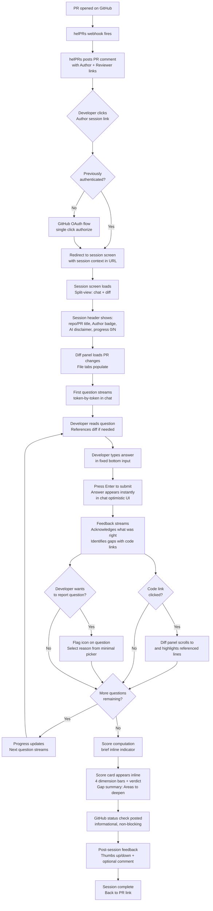
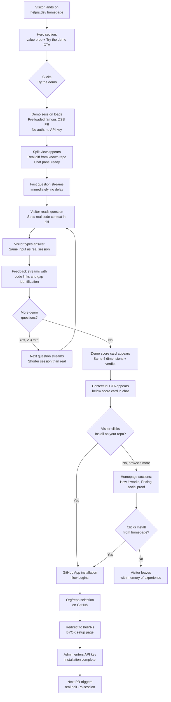
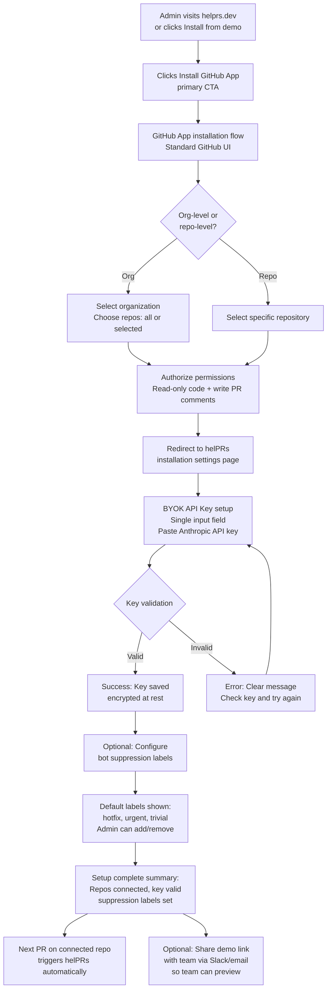

# UX Design Specification helPRs

**Author:** Marius.pruvot
**Date:** 2026-04-08

---

<!-- UX design content will be appended sequentially through collaborative workflow steps -->

## Executive Summary

### Project Vision

helPRs is a GitHub App that creates Socratic LLM chat sessions for each pull request, challenging developers to prove they understand their code before it ships. The core UX is a web-based split-view interface (chat on the left, PR diff on the right) where an AI acting as a senior staff engineer asks targeted comprehension questions -- not about correctness, but about understanding.

The product enters the developer's workflow through GitHub PR comments, not through a separate dashboard. This PR-native entry point means the UX must bridge the gap between GitHub's familiar interface and helPRs' web experience seamlessly.

The design language follows an OpenCode-inspired terminal-native aesthetic: Berkeley Mono monospace font, warm dark theme (#201d1d), flat surfaces with no shadows, 4px border radius, and Apple HIG semantic colors. This positions helPRs as a tool built by developers, for developers.

### Target Users

**Primary Users -- Developers:**
- PR authors who write code (often AI-assisted) and need to verify their own comprehension before review
- PR reviewers who need to prove they understand changes before approving them
- Tech-savvy audience (developers), comfortable with terminal aesthetics and code-centric UIs
- Primary device: desktop (laptop/monitor), used during work hours in IDE/browser workflow
- Context of use: during PR creation and review, typically mid-focus on a specific code change

**Secondary Users:**
- Engineering leaders who benefit indirectly through improved team review quality, but have no dedicated UI in MVP
- Admins (tech leads) who install and configure the GitHub App for their team, requiring a minimal but clear settings experience

**Acquisition Users:**
- Demo visitors who discover helPRs through word-of-mouth or social media and need to experience value in under 60 seconds without any signup or configuration

### Key Design Challenges

1. **PR-to-Web Transition Trust**: Developers click a link in a GitHub PR comment and land on an unfamiliar domain. The OAuth flow must be frictionless, and the first screen must immediately show familiar context (repository name, PR title, the diff they were just looking at) to maintain trust and orientation.

2. **Empowerment vs. Interrogation Tone**: The UX must consistently communicate "I'm helping you understand your code better" rather than "I'm testing you." This applies to question framing, feedback delivery, score presentation, and every micro-copy decision. The warm design system (warm darks, not cold blacks) supports this, but copy and interaction design carry most of the emotional weight.

3. **Zero-Friction Demo Experience**: A visitor must go from landing page to experiencing a full Socratic challenge in under 60 seconds, with no authentication, no API key, and no configuration. The demo must reproduce the complete experience on a pre-loaded open-source PR, including questions, answers, feedback, and scoring.

4. **Split-View Complexity on Varied Screens**: The core chat + diff split-view is the product's central screen. It must work well on standard developer monitors (1440px+) while remaining usable on smaller laptop screens (1280px). Mobile is not a primary concern for MVP but the layout must degrade gracefully.

### Design Opportunities

1. **The "Aha Moment" Orchestration**: If the first question in a session reveals a blind spot the developer hadn't considered, the product's value is proven instantly. The UX should be designed to maximize the impact of this moment -- sharp question presentation, immediate feedback with direct code links, and a visual "gap identified" treatment that feels enlightening rather than punitive.

2. **Feedback-as-Teaching Pattern**: After each answer, helPRs provides feedback with code section links. This transforms evaluation into learning. The interaction pattern (question → answer → feedback with code reference → next question) is unique to helPRs and deserves a distinctive visual treatment that makes the teaching moment feel rewarding.

3. **Demo-to-Install Conversion Flow**: A demo visitor who just experienced a compelling Socratic session is emotionally primed for conversion. A contextual "Install on your repo" CTA placed at the right moment in the demo flow (after scoring, when the value is most tangible) can achieve exceptional conversion rates.

4. **Score as Private Achievement**: Scores are private by default -- visible only to the session participant. This creates an opportunity to frame scoring as personal growth tracking rather than performance measurement. The score UI should feel like a personal dashboard, not a report card.

## Core User Experience

### Defining Experience

The core experience of helPRs is a single, uninterrupted conversational flow between a developer and an AI senior staff engineer, contextualized by the PR diff. Everything happens in one screen, one session, one continuous thread.

**The Core Loop:**
1. LLM posts a Socratic question in the chat panel
2. Developer reads the question, glances at the diff panel for context
3. Developer types their answer
4. LLM streams feedback inline -- including clickable code links that highlight and scroll the diff panel in real-time
5. Next question appears naturally in the conversation flow
6. After the final question + feedback, a score card appears inline as the conversation's conclusion

This loop repeats 3-10 times depending on PR size. The entire session should feel like a 5-15 minute conversation with a thoughtful colleague, not a form submission or exam.

**The Split-View:**
The session screen is a permanent two-panel layout: chat on the left (~60%), diff on the right (~40%). A draggable resize handle between panels lets developers adjust the ratio to their preference. Code links in chat feedback messages scroll and highlight the corresponding lines in the diff panel, creating a live connection between conversation and code.

Below ~1100px viewport width, the layout collapses to a tabbed interface (Chat / Diff toggle) to maintain usability on smaller laptops without sacrificing either panel's readability.

### Platform Strategy

**Primary Platform:** Desktop web (1280px+ viewport). Developers interact with helPRs during their PR workflow, which is inherently a desktop/laptop activity. The split-view chat + diff layout is optimized for screens 1280px and wider, with the best experience at 1440px+.

**Responsive Behavior:**
- **1440px+**: Full split-view, comfortable reading width for both panels
- **1280-1440px**: Split-view with tighter panel widths, still functional
- **1100-1280px**: Compressed split-view, resize handle becomes more important
- **< 1100px (tablet/small laptop)**: Tabbed mode -- Chat and Diff as switchable tabs
- **Mobile (< 768px)**: Chat-only view with a subtle banner: "Open on desktop for the full experience with code view." Chat remains fully functional -- questions are comprehensible without the diff since the developer has already seen it on GitHub

**Input Mode:** Keyboard-primary. Developers type answers in a text input. No drag-and-drop, no complex gestures. Mouse used only for resize handle, code link clicks, and navigation.

**Offline:** Not required. helPRs requires active LLM API connectivity. Graceful error handling if connection drops mid-session (preserve session state, allow retry).

### Effortless Interactions

**PR Comment to Session (< 3 clicks):**
Developer clicks session link in PR comment → GitHub OAuth (auto-approved if previously authorized, single click if not) → lands directly in the split-view with their diff already loaded and first question streaming. No landing page, no configuration, no "getting started" screen between the PR and the session.

**Feedback Code Links → Diff Highlight (zero navigation):**
When feedback references a code section, the developer clicks the inline link and the diff panel scrolls to and highlights the relevant lines. No new tab, no context switch. The teaching moment happens in-place.

**Question Flow (zero manual progression):**
After the developer submits an answer, feedback streams in automatically, followed by the next question. No "Next" button, no pagination. The conversation flows like a real chat.

**Demo Mode (zero setup):**
One click from landing page opens a pre-loaded session on a real open-source PR. No sign-up, no API key, no configuration. The visitor is answering their first question within 10 seconds of clicking "Try the demo."

**Score Delivery (zero navigation):**
Session score appears as the natural conclusion of the chat thread -- an inline card with the four dimension scores, verdict, and gap summary. No redirect to a "results page." The developer can scroll up to review their conversation and scroll down to see their score.

### Critical Success Moments

1. **The First Question Hit** (session open → first question displayed): Must happen in under 3 seconds. If the developer stares at a blank screen or a loading spinner, they close the tab. The first question must appear fast and be immediately compelling -- surfacing a blind spot the developer hadn't considered.

2. **The "I Didn't Think of That" Moment** (first feedback after answer): The first feedback response is where the product proves its value. If it identifies a genuine gap in the developer's understanding and links to the relevant code, trust is established. If the feedback is generic or wrong, trust is lost permanently.

3. **The Score Reveal** (session completion): The score must feel fair and insightful. A developer who engaged honestly should see a score that reflects their effort. The four-dimension breakdown (Depth, Accuracy, Completeness, Insight) prevents a single number from feeling reductive. The verdict (Exceptional/Strong/Adequate/Weak/Insufficient) gives an immediate human-readable signal.

4. **The Demo-to-Install Conversion** (demo completion → install CTA): After experiencing a compelling session, the demo visitor sees a contextual CTA: "That was a demo. Install helPRs on your repo to challenge yourself on your own PRs." This is the highest-intent moment in the entire acquisition funnel.

5. **The Return Visit** (second PR with helPRs): A developer who voluntarily clicks the helPRs session link on their second PR has validated the product. The second session should feel familiar (same layout, same flow) but fresh (different questions adapted to the new PR). No re-onboarding, no friction.

### Experience Principles

1. **Conversation, Not Examination**: Every interaction should feel like talking to a senior colleague who genuinely wants to help you understand your code better. The chat is a dialogue, not a test. Feedback teaches, scores inform, and the tone stays warm throughout.

2. **Context Always Visible**: The developer should never have to leave the session screen to understand a question or evaluate feedback. The diff panel, code links, and inline feedback ensure all context is immediately accessible without navigation.

3. **Zero Unnecessary Clicks**: If an action can happen automatically, it should. Question progression, feedback delivery, score computation, and code highlighting all happen without manual triggers. The developer's only job is reading and typing.

4. **Respect the Developer's Time**: A session should take 5-15 minutes, proportional to PR size. No filler questions, no redundant screens, no unnecessary steps. Every second in a helPRs session should provide value.

5. **Private by Default, Proud When Ready**: Scores are personal achievements, not performance metrics. The default is private visibility. When a developer chooses to share, it should feel like showing off, not being exposed.

## Desired Emotional Response

### Primary Emotional Goals

**Core Emotion: Curiosity-Driven Growth**
The dominant feeling throughout a helPRs session should be intellectual curiosity -- "Can I answer this? Let me think..." -- not performance anxiety. The product exists to satisfy a developer's desire to truly understand their own code, not to catch them lacking.

**The Trifecta of Positive Outcomes:**
Every session should end with one of three satisfying feelings:
1. **Confirmation**: "I actually know this code well. The session confirmed my understanding." (High score)
2. **Discovery**: "I learned something concrete about my own code that I hadn't considered." (Medium score with specific gaps identified)
3. **Motivation**: "There's more depth here than I realized. I want to dig deeper." (Low score, but with a clear path forward)

All three outcomes are positive. There is no "failure" state -- only varying degrees of growth and validation.

### Emotional Journey Mapping

| Stage | Desired Emotion | Emotion to Avoid | UX Lever |
|-------|----------------|------------------|----------|
| **PR comment seen** | Intrigue, light anticipation | Annoyance ("another bot") | Concise, warm comment copy; no wall of text |
| **Session opens** | Orientation, readiness | Confusion, distrust | Immediate context (repo name, PR title, diff loaded); fast first question (< 3s) |
| **First question** | Curiosity ("hmm, do I know this?") | Anxiety ("this is a test") | Question framed as exploration, not examination; warm conversational tone |
| **Typing answer** | Focused thinking, engagement | Pressure, time anxiety | No timer, no character limit, no "hurry up" signals; comfortable input area |
| **Receiving feedback** | Enlightenment, respect | Shame, defensiveness | Feedback acknowledges what was right before identifying gaps; code links feel like helpful pointers, not corrections |
| **Low score (3-4/10)** | Motivation, resolve | Discouragement, embarrassment | Frame gaps as learning opportunities; show specific areas to explore; no punitive language |
| **High score (8-9/10)** | Earned pride, validation | Complacency | Acknowledge depth of understanding; highlight the hardest questions answered well |
| **Session complete** | Satisfaction, "time well spent" | Relief ("thank god that's over") | Score card feels like a personal achievement summary, not a verdict |
| **Return visit (2nd PR)** | Familiarity, anticipation | Fatigue, obligation | Same comfortable environment, fresh questions; no re-onboarding |

### Micro-Emotions

**Confidence → Build Progressively:**
The first question should be approachable enough that most developers can engage (building initial confidence), then questions escalate in depth. A developer should never feel lost from question one.

**Trust → Earned Through Transparency:**
The AI is explicitly presented as an AI. A persistent, subtle disclaimer communicates that questions are AI-generated and may contain inaccuracies. This isn't hidden in a footer -- it's part of the session header context, normalized and honest. When the AI gets something wrong, the developer feels informed ("I was told this could happen") rather than betrayed.

**Accomplishment → After Every Answer:**
Each feedback response should begin by acknowledging what the developer got right before addressing gaps. Even partial answers deserve recognition. The developer should feel they made progress with every interaction, not just at the end.

**Belonging → "This Tool Gets Developers":**
The monospace aesthetic, the terminal-native feel, the code-centric UI, the technical depth of questions -- everything should signal that this tool was built by people who understand the developer workflow. The emotional subtext: "this was made for people like me."

### Design Implications

**Curiosity, Not Challenge → Question Framing:**
Questions should read as genuine intellectual exploration: "What happens if..." / "How does this interact with..." / "What tradeoff did you consider..." -- never as interrogation: "Why didn't you..." / "Can you justify..." / "Explain yourself..."

**Motivation on Low Scores → Score Presentation:**
A score of 4/10 should be presented with actionable context: which dimensions scored low, what specific areas to explore, and an encouraging frame ("Areas to deepen"). Never "You failed on:" or "Weaknesses:". The gap summary is a learning roadmap, not a failure report.

**Sparring Partner Vibe → Overall Tone:**
The word-of-mouth emotion is: "It feels good to be challenged. It either confirms what I know or helps me go deeper." This means the AI persona should feel like a knowledgeable peer who respects the developer's competence while pushing them to think harder -- a sparring partner, not an examiner.

**AI Transparency → Hallucination Handling:**
The app should normalize AI imperfection openly. A session-level notice explains that questions are AI-generated and may occasionally miss the mark. The report button is positioned as a collaborative quality signal ("Help us improve"), not an error complaint. When a developer flags a question, the response should feel empowering: "Thanks for flagging -- your signal helps improve questions for everyone."

### Emotional Design Principles

1. **Curiosity Over Pressure**: Frame every question as an invitation to think, never a demand to perform. The developer should lean forward with interest, not brace for judgment.

2. **Growth Over Grading**: Every score is a snapshot of where you are, not a verdict on who you are. Low scores are opportunities with clear next steps. High scores are earned validation.

3. **Honesty Over Polish**: The AI is transparent about its nature and limitations. Questions may be imperfect. The developer is always in control -- they can report, skip context, or end the session. Trust is built through honesty, not through the illusion of perfection.

4. **Respect Over Gamification**: No streaks, no leaderboards, no "you missed a day" guilt. The developer engages because the experience is valuable, not because of extrinsic motivation mechanics. Respect their autonomy and intelligence.

5. **Warmth Over Neutrality**: The warm dark theme (#201d1d), the conversational tone, the feedback that starts with acknowledgment -- every design choice should add warmth. Clinical neutrality feels cold and institutional. helPRs should feel like a place developers want to return to.

## UX Pattern Analysis & Inspiration

### Inspiring Products Analysis

**1. Claude.ai -- Primary Interaction Model**

Claude.ai is the foundational UX reference for the helPRs chat experience. Developers who use LLM tools already know this pattern intimately, which means zero learning curve on the core interaction.

**What to adopt directly:**
- Token-by-token streaming that creates the sensation of "someone is thinking and talking to me" -- essential for the conversational sparring partner feel
- Input area fixed at the bottom, always visible -- the developer always knows where to type
- Natural scroll behavior where older messages scroll up as new content appears
- Rendered markdown in messages -- code blocks, inline code, links, and lists in feedback render naturally within the conversation flow
- Message-based UI structure where each question, answer, and feedback is a discrete message in a continuous thread

**What makes Claude.ai work emotionally:**
The streaming creates intimacy. Watching a response form word-by-word feels like watching someone think in real-time. This is critical for helPRs: the feedback after each answer should stream in, creating a moment of anticipation and engagement rather than a jarring "result appeared."

**What helPRs adapts from Claude.ai:**
- Claude.ai is free-form conversation; helPRs is structured (question → answer → feedback → next question). The developer cannot change the subject, ask their own questions, or redirect the session. The chat input accepts only answers, not prompts
- Claude.ai is single-column; helPRs adds the diff panel as a permanent right-side companion. The chat panel must feel complete on its own while being enhanced by the diff context
- Claude.ai has no scoring or progression; helPRs adds an inline score card at the end and a subtle progress indicator (e.g., "Question 3 of 7") so the developer knows where they are in the session

**2. GitHub PR Diff View -- Right Panel Reference**

The diff panel in helPRs should feel immediately familiar to any developer who reviews PRs on GitHub. This is not a novel interface -- it is a deliberate mirror of what they already use daily.

**What to adopt directly:**
- Unified diff format with green/red line highlighting for additions/removals
- File tree or file tabs for navigating between changed files
- Line numbers visible on both sides (old/new)
- Syntax highlighting matching the repository's language
- Expandable context (show surrounding unchanged lines when needed)

**What makes GitHub diff work for helPRs:**
When a code link in the chat feedback says "look at line 47 of retry.ts," the diff panel scrolls to that exact location and highlights it. The developer does not need to mentally translate a file reference -- they see the code instantly, in the same format they see it on GitHub. This is the key bridge between the chat experience and the code context.

**What helPRs adapts from GitHub:**
- GitHub diff is interactive (you can comment, suggest changes, expand context). helPRs diff is read-only -- it exists as reference, not as an editing surface. No comment buttons, no suggestion UI, no review actions. This keeps the panel clean and focused
- GitHub shows all files equally. helPRs can highlight the specific files being discussed in the current question, with a subtle visual indicator (e.g., active file tab highlighted with accent blue)

**3. Linear -- Speed and Minimalism Reference**

Linear sets the standard for developer tool UX: every action feels instant, every screen is minimal, and the interface never gets in the way of the task.

**What to adopt as principles:**
- Perceived instant response on every interaction -- no loading spinners for actions that should feel immediate (sending an answer, navigating between files in the diff)
- Minimal chrome: the UI should be mostly content (chat messages + diff code), with navigation and controls reduced to the absolute minimum
- Keyboard-friendly: Enter to submit an answer, common keyboard shortcuts for diff navigation
- No unnecessary confirmation dialogs, no "are you sure?" gates. The developer's intent is clear; the UI should trust it

**What Linear teaches about developer trust:**
Linear never second-guesses the user. It does not ask "are you sure you want to mark this as done?" -- it just does it and provides an undo. helPRs should adopt this philosophy: when the developer submits an answer, it is submitted. No preview step, no confirmation modal. If the developer wants to revise, they can add context in their next answer.

### Transferable UX Patterns

**Chat Pattern (from Claude.ai):**
- Streaming responses for all LLM-generated content (questions, feedback, score narrative)
- Fixed bottom input with generous padding and clear submit affordance
- Message bubbles with distinct visual treatment for AI messages vs. developer messages
- Markdown rendering within messages for rich feedback content

**Diff Pattern (from GitHub):**
- Unified diff with syntax highlighting, line numbers, and file navigation
- Scroll-to-line-and-highlight when a code link is clicked in the chat
- File tabs or file list for multi-file PRs
- Read-only mode -- no editing, commenting, or review actions in the diff panel

**Speed Pattern (from Linear):**
- Optimistic UI: show the developer's answer immediately in the chat, start streaming feedback without a visible "processing" state
- Minimal transition animations -- state changes should feel instant, not animated
- No loading spinners for sub-second operations; skeleton states only for operations > 1 second
- Keyboard shortcuts for power users (submit answer, toggle diff panel, navigate files)

**Cross-Panel Linking (helPRs-original):**
- Code references in chat feedback are clickable links that scroll and highlight the diff panel
- Active file in diff panel is visually linked to the current question's context
- Hover on a code link previews the target location in the diff (subtle highlight without scrolling)
- This cross-panel linking pattern is the unique UX innovation of helPRs -- no existing product combines conversational AI with live code context navigation

### Anti-Patterns to Avoid

**From AI Chat Tools:**
- Multi-step "thinking" indicators that make the developer wait without progress signal. If the LLM is processing, stream partial output immediately rather than showing "Thinking..."
- Regenerate buttons that imply the AI output is unreliable. helPRs questions are one-shot and intentional; no regeneration needed
- Copy/paste buttons on every message. helPRs is not a code generation tool; there is nothing to copy from a comprehension question

**From PR Review Bots:**
- Wall-of-text PR comments. CodeRabbit and similar tools post long, dense comments that developers learn to skip. The helPRs PR comment should be 2-3 lines maximum: a warm one-liner and the session link
- Inline code suggestions that create noise in the PR. helPRs never touches the code -- it only asks about it. The PR comment is an invitation, not a review
- Severity badges and warning counts that create anxiety. No red "critical" badges in helPRs

**From Learning Platforms:**
- Progress bars that make incomplete sessions feel like failure. If a developer answers 4 of 7 questions and leaves, that is 4 questions' worth of value, not a 57% completion failure
- Gamification mechanics (streaks, badges, XP) that create extrinsic motivation pressure. helPRs value is intrinsic -- the questions themselves are the reward
- Mandatory onboarding tutorials before the user can access the core experience. helPRs should be usable from the first click with no tutorial

**From Developer Tools:**
- Complex settings pages as first-time experience. The admin BYOK setup should be minimal and the developer should never see a settings page
- Feature tours and tooltips overlaying the interface on first visit. The split-view is self-evident to developers; trust their competence

### Design Inspiration Strategy

**Adopt Directly:**
- Claude.ai chat streaming and message-based conversation UI → helPRs chat panel
- GitHub unified diff format with syntax highlighting → helPRs diff panel
- Linear's instant-feel interactions and minimal chrome → helPRs overall UI responsiveness

**Adapt for helPRs:**
- Claude.ai free-form conversation → structured question-answer-feedback cycle with progress indicator
- GitHub interactive diff (comments, suggestions) → read-only diff with cross-panel code link highlighting
- Linear's keyboard shortcuts → adapted for chat context (Enter to submit, Cmd+D to toggle diff, arrow keys for file navigation)

**Avoid Entirely:**
- CodeRabbit-style verbose PR comments → keep PR comment to 2-3 lines
- Learning platform gamification (streaks, badges, leaderboards) → intrinsic value only
- AI tool "thinking" indicators without streaming → always stream partial output
- Onboarding tutorials and feature tours → trust developer competence, make UI self-evident

## Design System Foundation

### Design System Choice

**Approach: Custom Design Tokens + Tailwind CSS + Headless Primitives**

helPRs uses a pre-existing custom design system documented in `design/DESIGN.md`, inspired by OpenCode's terminal-native aesthetic. This is not a decision to make -- it is a foundation already established. The implementation strategy translates these documented tokens into a production-ready CSS framework.

No component library (MUI, Chakra, Ant Design, etc.) is adopted. The terminal-native, monospace-first aesthetic of helPRs is incompatible with any existing component library's visual defaults. The cost of overriding a library's opinions exceeds the cost of building the small number of custom components helPRs needs.

### Rationale for Selection

**Why Tailwind CSS:**
- Design tokens from DESIGN.md (colors, spacing, radius, typography) translate directly into `tailwind.config.ts` with zero abstraction gap
- Utility-first approach matches the small team (2 people) and fast timeline (6-week MVP) -- no time for a custom CSS architecture
- No visual opinions imposed -- Tailwind provides the tooling, the DESIGN.md provides the aesthetics
- Excellent dark mode support via CSS custom properties, aligning with the warm dark theme as the primary mode

**Why no component library:**
- helPRs has a deliberately narrow component surface: chat messages, text input, diff viewer, score card, buttons, and minimal navigation. This does not justify a full component library
- Every existing library's button, input, and card would need extensive restyling to match the OpenCode aesthetic (flat, no-shadow, 4px radius, Berkeley Mono). The override cost exceeds the build cost
- The terminal-native identity requires components that feel custom-built, not framework-generated

**Why headless primitives for interactive patterns:**
- Resizable split-view panel: a headless resize primitive provides keyboard-accessible, pointer-aware resize behavior without imposing visual styles
- Diff viewer: an existing code diff component (e.g., react-diff-viewer or Monaco-based) provides syntax highlighting and diff rendering, styled with helPRs tokens
- These primitives deliver accessibility and behavior for free while accepting full visual customization

### Implementation Approach

**Design Token Pipeline:**

The `design/DESIGN.md` documents all tokens. These are translated into:

1. **CSS Custom Properties** (`:root` level): The source of truth for all design values, enabling runtime theme switching if needed
2. **Tailwind Config** (`tailwind.config.ts`): Maps CSS custom properties to Tailwind utility classes for use in components
3. **TypeScript Constants** (optional): For programmatic access to token values in JavaScript logic (e.g., chart colors, dynamic styling)

**Token Categories from DESIGN.md:**

| Category | Tokens | Source |
|----------|--------|--------|
| **Colors -- Primary** | `#201d1d` (dark), `#fdfcfc` (light), `#9a9898` (gray), `#302c2c` (dark surface) | DESIGN.md Section 2 |
| **Colors -- Semantic** | `#007aff` (accent), `#ff3b30` (danger), `#30d158` (success), `#ff9f0a` (warning) + hover/active variants | DESIGN.md Section 2 |
| **Colors -- Border** | `rgba(15, 0, 0, 0.12)` (warm), `#9a9898` (tab), `#646262` (outline) | DESIGN.md Section 2 |
| **Typography** | Berkeley Mono (fallback: IBM Plex Mono, system monospace). Sizes: 38px/16px/14px. Weights: 700/500/400 | DESIGN.md Section 3 |
| **Spacing** | 8px base grid: 1, 2, 4, 8, 12, 16, 20, 24, 32, 40, 48, 64, 80, 96 | DESIGN.md Section 5 |
| **Border Radius** | 4px (default), 6px (inputs) | DESIGN.md Section 5 |
| **Elevation** | Flat (no shadows). Depth via borders only: warm transparent, tab indicator, solid outline | DESIGN.md Section 6 |

**Component Inventory (MVP):**

| Component | Type | Notes |
|-----------|------|-------|
| Chat message (AI) | Custom | Markdown-rendered, streaming-aware, with code link support |
| Chat message (User) | Custom | Plain text, visually distinct from AI messages |
| Chat input | Custom | Fixed bottom, generous padding, Enter to submit |
| Score card | Custom | Inline in chat, 4-dimension bars, verdict badge |
| Diff viewer | Headless/library | Syntax-highlighted unified diff, scroll-to-line API |
| Resize handle | Headless primitive | Draggable panel divider, keyboard accessible |
| Session header | Custom | Repo name, PR title, role badge, progress indicator, AI disclaimer |
| Button (primary) | Custom | Dark fill, 4px radius, 4px 20px padding |
| Button (secondary) | Custom | Outline, 4px radius |
| Report button | Custom | Per-question, inline, subtle |
| Navigation | Custom | Minimal top bar for session context |
| Landing page | Custom | Marketing page with demo CTA |

### Customization Strategy

**Dark Mode as Primary:**
The warm dark theme (`#201d1d` background, `#fdfcfc` text) is the default and primary mode. This matches the developer tool identity and the OpenCode inspiration. Light mode is not planned for MVP -- the design system documents light surface tokens (`#f1eeee`, `#f8f7f7`) but these are reserved for future consideration.

**Font Strategy:**
Berkeley Mono is the ideal font but requires a commercial license. The implementation should use Berkeley Mono as the primary with IBM Plex Mono as the free fallback (already loaded in the DESIGN.md preview files). The font stack degrades gracefully: `Berkeley Mono, IBM Plex Mono, ui-monospace, SFMono-Regular, Menlo, Monaco, Consolas, Liberation Mono, Courier New, monospace`.

**Interaction States:**
All semantic colors (accent, danger, success, warning) have three-stage interaction sequences documented in DESIGN.md: default → hover (darkened) → active (deeply darkened). These are implemented as Tailwind hover/active variants.

**Animation Philosophy:**
Consistent with the flat, terminal-native aesthetic: minimal transitions (100-150ms for color changes), no scale/rotate/transform animations, no entrance/exit animations for components. State changes feel instant. The only notable motion is the streaming text effect in chat messages, which is functional (showing LLM output progress), not decorative.

## Defining Core Experience

### The One-Line Experience

**"Answer a question about your own code and discover what you didn't know."**

This is helPRs' Tinder swipe. What a developer tells a colleague: "helPRs asks you questions about your PR and you realize there's stuff you hadn't thought about." The core action is answering a single Socratic question with your code in front of you.

### User Mental Model

**Primary Mental Model: "A code review dry run"**

The developer approaches helPRs as preparation for the real human review. The mental model is: "Before my reviewer looks at this PR, let me make sure I can defend every decision." This framing is powerful because:

- It positions helPRs as a tool that helps the developer look competent, not one that exposes incompetence
- It creates a natural moment in the workflow: after opening a PR, before requesting review
- It aligns with an existing developer behavior (self-reviewing before tagging a reviewer)
- It makes the session feel productive rather than imposed -- "I'm doing this for myself"

**How this mental model shapes UX copy:**
- PR comment: "Ready to defend your PR?" or "Prepare for review" -- not "Take your comprehension test"
- Session header: framed as preparation context, not examination context
- Score: presented as review readiness signal -- "How prepared are you to defend this PR?"

**Current Solutions (What Developers Do Today):**
- Re-read their own diff on GitHub before requesting review (passive, no challenge)
- Ask a colleague to "take a quick look" informally (social cost, unstructured)
- Self-review mentally while writing the PR description (no external validation)
- Skip self-review entirely and hope the reviewer catches issues (the most common path)

helPRs replaces all of these with a structured, AI-powered dry run that is faster than asking a colleague and more rigorous than self-review.

**Reviewer Mental Model: "Review preparation"**
The reviewer approaches their session as: "Before I approve this, let me make sure I actually understand what it does." This is review preparation, not a test of the reviewer's skills. The framing: "Don't LGTM what you don't understand."

### Success Criteria

**Core Interaction Success:**

| Criterion | Measurement | Target |
|-----------|-------------|--------|
| First question feels relevant | Question addresses a real decision or tradeoff in the PR, not a trivial observation | >90% of first questions rated relevant by users |
| Feedback teaches something new | Developer learns at least one thing they hadn't considered | >60% of sessions include at least one "gap identified" feedback |
| Session feels proportional | Time spent matches PR complexity -- not too long for small PRs, not too shallow for large ones | 3-5 min for small PRs, 5-10 min for medium, 10-15 min for large |
| Score feels fair | Developer agrees with the score's assessment of their understanding | Question report rate <5% |
| Developer returns voluntarily | Second PR with helPRs without being prompted | >40% return rate on consecutive PRs |

**Failure Criteria (If Any of These Happen, the Core Experience Has Failed):**
- Developer closes the tab before answering the first question (question was too slow or irrelevant)
- Developer answers all questions with one-word responses (questions aren't engaging enough)
- Developer reports more than one question per session as irrelevant (question quality too low)
- Developer feels the score doesn't reflect their effort (scoring feels arbitrary)
- Developer describes the experience as "another annoying bot" (tone failed)

### Novel UX Patterns

**Pattern Classification: Innovative Combination of Established Patterns**

helPRs does not invent new interaction primitives. It combines three well-understood patterns in a novel way:

1. **AI Chat (from Claude.ai)** -- established, developers know how to use it
2. **Code Diff View (from GitHub)** -- established, developers see it daily
3. **Cross-Panel Code Linking** -- the novel connector between 1 and 2

The innovation is the live link between conversation and code. When feedback in the chat references a code section, clicking it scrolls and highlights the diff panel. No existing product does this. This is helPRs' interaction signature.

**No User Education Needed:**
- Developers know how to chat with an AI (Claude.ai pattern)
- Developers know how to read a diff (GitHub pattern)
- The only new behavior is clicking a code link in the chat to see it highlighted in the diff -- this is self-evident and requires no tutorial

**The "Review Dry Run" Frame as Innovation:**
The conceptual innovation is not the interface -- it is the positioning. No tool frames AI-powered code analysis as "prepare to defend your PR." This framing transforms what could feel like an AI audit into a self-improvement ritual. The UX must reinforce this frame at every touchpoint.

### Experience Mechanics

**1. Initiation:**

| Step | Action | System Response | Time |
|------|--------|----------------|------|
| PR opened | Developer opens/pushes to a PR | Webhook triggers helPRs | Immediate |
| Comment posted | helPRs posts PR comment with session links | Two links: Author session, Reviewer session | < 10s after PR event |
| Session click | Developer clicks their session link | Redirect to helPRs web app with session context | Immediate |
| OAuth | GitHub OAuth (if first visit) | Transparent auth, redirect back to session | 1 click if first time, 0 if returning |
| Session loads | Split-view renders with diff | Diff panel loads PR changes, chat panel shows session header | < 2s |
| First question | LLM generates and streams first question | Question appears token-by-token in chat | < 3s from session load |

**Total time from PR comment click to first question: < 5 seconds for returning users, < 8 seconds for first-time users.**

**2. Core Interaction Cycle (repeats 3-10 times):**

| Step | Actor | UI Behavior |
|------|-------|-------------|
| Question displayed | AI | Streams token-by-token into chat panel. Progress indicator updates ("Question 2 of 7"). If question references specific code, diff panel auto-scrolls to relevant file |
| Developer reads + thinks | User | Chat input is enabled. No timer, no pressure indicators. Developer may click between files in diff panel to review context |
| Answer submitted | User | Press Enter or click Send. Answer appears immediately in chat (optimistic UI). Input clears. Input is temporarily disabled while feedback generates |
| Feedback streams | AI | Feedback streams token-by-token. Begins with acknowledgment of what was right. Then identifies gaps with clickable code links. Code links highlight diff panel on click |
| Report (optional) | User | Small flag icon on question message. One click opens a minimal "Why is this question problematic?" selector. No interruption to flow |
| Transition | AI | Brief visual separator. Next question begins streaming. No manual "Next" button |

**3. Completion:**

| Step | Actor | UI Behavior |
|------|-------|-------------|
| Last feedback delivered | AI | Final feedback streams. Brief pause (500ms) |
| Score computation | System | Inline loading indicator in chat ("Computing your comprehension score...") |
| Score card appears | AI | Inline card in chat: 4 horizontal bars (Depth, Accuracy, Completeness, Insight), overall verdict badge, gap summary with "Areas to deepen" framing |
| GitHub status check | System | Informational status check posted to PR (non-blocking). Shows verdict and score |
| Post-session feedback | User | Thumbs up/down + optional comment. Appears below score card. Not intrusive |
| Session ends | System | Chat input disabled. "Session complete" state. Link to "Back to PR" returns to GitHub |

**4. Error Handling:**

| Error | UX Response |
|-------|-------------|
| LLM API timeout | "Taking a moment to think..." with subtle spinner. Retry automatically after 5s. If persistent, show "Connection issue. Your progress is saved -- try refreshing." |
| LLM produces empty response | Skip and move to next question with a note: "Skipped a question that didn't generate properly." |
| Session state lost (server restart) | On page reload, restore session from server-side state. Resume from last answered question |
| Invalid BYOK API key | Before session starts, show clear error: "API key validation failed. Ask your admin to check the configuration." No session loads |
| Developer loses internet | Chat input shows "Reconnecting..." Answers queued locally and sent when connection restores |

## Visual Design Foundation

### Color System

The complete color system is documented in `design/DESIGN.md` (Sections 2 and 9). Key decisions for the helPRs application context:

**Session Screen Color Usage:**

| Element | Color | Token |
|---------|-------|-------|
| Page background | `#201d1d` | `--oc-dark` |
| Chat panel background | `#201d1d` | `--oc-dark` (same as page -- seamless) |
| Diff panel background | `#302c2c` | `--oc-dark-surface` (subtle elevation to distinguish panels) |
| Resize handle | `#646262` | `--border-outline` (visible but not dominant) |
| AI message text | `#fdfcfc` | `--oc-light` |
| User message text | `#fdfcfc` | `--oc-light` |
| User message background | `#302c2c` | `--oc-dark-surface` (distinguishes user messages from AI) |
| Code link in feedback | `#007aff` | `--accent` (clickable, draws attention) |
| Code highlight in diff | `rgba(0, 122, 255, 0.15)` | Accent blue at 15% opacity (visible but not overwhelming) |
| Progress indicator | `#9a9898` | `--oc-gray` (subtle, not distracting) |
| Score bar -- Depth | `#007aff` | `--accent` |
| Score bar -- Accuracy | `#30d158` | `--success` |
| Score bar -- Completeness | `#ff9f0a` | `--warning` |
| Score bar -- Insight | `#ff3b30` | Repurposed as a warm accent for Insight dimension |
| Report button | `#6e6e73` | `--text-muted` (subtle, not alarming) |
| Role badge "Author" | `#007aff` at 15% opacity bg, `#007aff` text | Accent treatment |
| Role badge "Reviewing" | `#ff9f0a` at 15% opacity bg, `#ff9f0a` text | Warning treatment (differentiated from author) |

**Score Verdict Color Mapping:**

| Verdict | Color | Rationale |
|---------|-------|-----------|
| Exceptional (9-10) | `#30d158` (success green) | Earned pride |
| Strong (7-8) | `#007aff` (accent blue) | Confident, solid |
| Adequate (5-6) | `#9a9898` (mid gray) | Neutral, room to grow |
| Weak (3-4) | `#ff9f0a` (warning orange) | Attention needed, not alarm |
| Insufficient (0-2) | `#ff9f0a` (warning orange) | Same as Weak -- never use danger red for scores. Red = destructive actions only |

**Critical Color Decision: No red in scoring.** Even the lowest score uses warning orange, not danger red. Danger red is reserved exclusively for destructive actions (delete, error states). Using red for low scores would contradict the "Growth Over Grading" emotional principle.

### Typography System

The complete typography system is documented in `design/DESIGN.md` (Section 3). Application-specific typography decisions:

**Chat Panel Typography:**

| Element | Size | Weight | Line Height | Notes |
|---------|------|--------|-------------|-------|
| AI question text | 16px | 400 | 1.50 | Standard body, readable at length |
| User answer text | 16px | 400 | 1.50 | Same as AI for visual consistency |
| Feedback text | 16px | 400 | 1.50 | Same reading weight as questions |
| Code blocks in feedback | 14px | 400 | 1.50 | Slightly smaller, still monospace |
| Code links in feedback | 16px | 500 | 1.50 | Medium weight + accent color = clickable affordance |
| Progress indicator | 14px | 400 | 2.00 | Caption style, relaxed line-height |
| Score verdict | 16px | 700 | 1.50 | Bold heading weight for emphasis |
| Score dimension labels | 14px | 500 | 1.50 | Medium weight, slightly smaller |

**Diff Panel Typography:**

| Element | Size | Weight | Notes |
|---------|------|--------|-------|
| Code content | 14px | 400 | Standard code size for diff readability |
| Line numbers | 14px | 400 | Same as code, muted color (`#6e6e73`) |
| File tabs | 14px | 500 | Medium weight for navigation |
| Active file tab | 14px | 700 | Bold to indicate current file |

**Session Header Typography:**

| Element | Size | Weight | Notes |
|---------|------|--------|-------|
| Repository name | 16px | 700 | Bold, primary text |
| PR title | 16px | 400 | Regular weight, secondary positioning |
| Role badge text | 12px | 500 | Small, medium weight, uppercase |
| AI disclaimer | 12px | 400 | Caption size, muted color |

### Spacing & Layout Foundation

The spacing system follows the 8px base grid documented in `design/DESIGN.md` (Section 5). Application-specific spacing:

**Split-View Layout:**

| Dimension | Value | Notes |
|-----------|-------|-------|
| Session header height | 48px | Fixed, 12px vertical padding |
| Chat panel width | ~60% default | Resizable via drag handle |
| Diff panel width | ~40% default | Resizable via drag handle |
| Resize handle width | 4px visual, 12px hit area | Thin visual, wide grab target |
| Chat message padding | 16px horizontal, 12px vertical | Comfortable reading margins |
| Chat input height | 48px minimum, auto-expand | Generous input area |
| Chat input padding | 16px | Consistent with message padding |
| Message gap | 8px between messages | Tight enough to feel conversational |
| Question-to-feedback gap | 16px | Slightly more space to visually separate the cycle |
| Score card padding | 24px | More generous for the summary section |
| Diff panel padding | 0px (code fills edge-to-edge) | Maximizes code visibility |
| File tab bar height | 40px | Compact navigation |

**Content Width Constraints:**
- Chat messages: max-width 720px within the chat panel (prevents excessively wide text on large panels)
- Diff code: no max-width constraint (code should use all available horizontal space)

### Accessibility Considerations

**Color Contrast:**
All text/background combinations in the design system meet WCAG 2.1 AA standards:
- Primary text (`#fdfcfc`) on dark background (`#201d1d`): contrast ratio ~17.5:1 (exceeds AAA)
- Secondary text (`#9a9898`) on dark background (`#201d1d`): contrast ratio ~5.2:1 (meets AA)
- Muted text (`#6e6e73`) on dark background (`#201d1d`): contrast ratio ~3.8:1 (meets AA for large text only -- used only for captions and labels)
- Accent blue (`#007aff`) on dark background (`#201d1d`): contrast ratio ~4.7:1 (meets AA)

**Keyboard Accessibility:**
- All interactive elements are reachable via Tab navigation
- Chat input: Enter to submit, Shift+Enter for newline
- Resize handle: arrow keys to adjust panel width
- Code links: focusable, Enter to activate
- Report button: focusable, Enter to activate
- File tabs: arrow keys to navigate, Enter to select

**Screen Reader Considerations:**
- AI messages announced with "helPRs asks:" prefix
- User messages announced with "You answered:" prefix
- Feedback announced with "Feedback:" prefix
- Score card uses ARIA labels for dimension values and verdict
- Progress indicator uses aria-live="polite" for question count updates
- Code links include aria-label describing target file and line

**Reduced Motion:**
- Streaming text respects prefers-reduced-motion: if enabled, full message appears at once instead of token-by-token
- All 100-150ms color transitions are removed under reduced motion
- Code highlight in diff panel appears instantly instead of fading in

## User Journey Flows

### Journey 1: PR Author Session (Primary Flow)

**Entry:** Developer sees helPRs comment on their PR in GitHub
**Goal:** Prepare to defend the PR before human review
**Duration:** 5-15 minutes depending on PR size

**Key UX Decisions in This Flow:**
- No intermediate screens between PR comment click and session load
- OAuth is transparent for returning users (zero clicks)
- First question begins streaming before the developer has finished scanning the diff -- captures attention immediately
- Report button is always available but never interrupts the flow
- Score card is the natural conclusion of the conversation, not a separate page

### Journey 2: Demo Visitor (Acquisition Flow)

**Entry:** Visitor lands on helPRs homepage from social media, tweet, or word-of-mouth
**Goal:** Experience the value of helPRs in under 60 seconds, convert to installation
**Duration:** 2-5 minutes

**Key UX Decisions in This Flow:**
- Demo is shorter than real session (2-3 questions vs 3-10) to respect visitor's exploratory mindset
- No authentication barrier -- demo works for anonymous visitors
- The demo uses a real, recognizable open-source PR so the code context feels authentic
- CTA appears at the highest-intent moment: right after seeing the score, when value is proven
- If visitor doesn't convert immediately, the homepage provides additional context without blocking the demo path

### Journey 3: Admin Setup (Configuration Flow)

**Entry:** Tech lead asked to install helPRs for their team
**Goal:** Complete setup in under 10 minutes
**Duration:** 5-10 minutes

**Key UX Decisions in This Flow:**
- Setup page has ONE primary task: enter the API key. Everything else is optional with sensible defaults
- No billing UI in MVP -- per-seat billing handled via Stripe checkout link or manual setup
- Bot suppression labels have defaults (hotfix, urgent, trivial) -- admin only needs to adjust if they have custom labels
- Setup complete state shows a clear summary and next steps
- Optional team sharing: admin can copy a demo link to share with the team before the first real session

### Journey 4: PR Reviewer Session (Condensed -- Variant of Author)

The reviewer flow is structurally identical to the Author flow with three differences:

1. **Entry:** Reviewer clicks the "Reviewer session" link in the same PR comment (separate link from author)
2. **Role Badge:** Session header shows "Reviewing" badge (orange) instead of "Author" badge (blue)
3. **Question Type:** Questions probe understanding of what the changes do and their impact ("What user-facing behavior changes as a result of this PR?") rather than decisions and tradeoffs ("Why did you choose exponential backoff here?")

All other mechanics (split-view, streaming, feedback, scoring, code links) are identical. The reviewer sees the same diff. The score dimensions are the same (Depth, Accuracy, Completeness, Insight) but calibrated for reviewer-level understanding.

**Key UX Decision:** No visual or structural distinction beyond the role badge and question content. The reviewer should feel they are using the same tool, not a lesser version of it.

### Journey 5: Return Visit (Condensed -- Variant of Author)

The return visit flow is the Author flow with friction removed:

1. **OAuth:** Automatic (already authorized, zero clicks)
2. **Onboarding:** None (returning user knows the interface)
3. **Session Context:** New PR, new questions, same familiar layout
4. **Emotional Tone:** Familiarity + anticipation ("let's see what this PR surfaces")

The only new element: if the developer's previous session score is available, it is NOT shown at the start of the new session. Each session is independent. No "your last score was..." framing that creates pressure to improve.

**Key UX Decision:** Treat every session as fresh. No comparison to previous sessions, no streak tracking, no "you improved by X%." The value is in each individual session, not in a longitudinal metric.

### Journey Patterns

**Entry Pattern: Link → Auth → Context → Action**
All developer journeys (Author, Reviewer, Return) follow the same entry pattern: click a link → transparent auth → immediate context (diff loaded, header populated) → first meaningful action (question streams). This pattern should feel instant for returning users.

**Conversation Pattern: Question → Answer → Feedback → Repeat**
The core interaction cycle is identical across Author and Reviewer sessions. The only variable is question content and count. This consistency means the interface can be tested and refined once, not per-role.

**Completion Pattern: Score → Feedback → Exit**
All session completions follow: inline score card → optional feedback (thumbs up/down) → back to PR link. No post-session upsell, no "what's next" suggestions, no newsletter signup. The session ends cleanly.

**Acquisition Pattern: Experience → CTA → Setup**
The demo flow follows: experience the core value → contextual CTA at peak engagement → streamlined setup. No intermediate pages, no feature tours, no pricing comparison before the CTA. Let the experience sell the product.

### Flow Optimization Principles

1. **Every flow starts with value, not configuration.** The developer sees a question (value) before they see any settings. The demo visitor experiences the session before they see pricing. The admin configures after seeing what helPRs does.

2. **Authentication is a speed bump, not a gate.** OAuth should be invisible for returning users and a single click for new users. No login page, no email/password form, no "create account" step.

3. **Error recovery preserves progress.** If the LLM fails mid-session, the developer's answers are saved. If the browser crashes, the session resumes from the last answered question. Progress is never lost.

4. **Exit points are always clean.** A developer can leave a session at any point without guilt or penalty. Partial sessions are partial value, not failures. The "Back to PR" link is always visible.

5. **Conversion happens at peak engagement.** The demo CTA appears after the score reveal (highest-intent moment). The install prompt appears after the developer has experienced the aha moment. Never ask for commitment before value is proven.
