# Architecture

This document explains how helPRs works for contributors and curious self-hosters. For deployment instructions, see [Self-Hosting Guide](self-hosting.md). For the decision rationale behind the container model, see [ADR-001](adr-001-claude-code-container-pivot.md).

---

## System Overview

```mermaid
graph TB
    GH[GitHub] -->|webhook| WH[Webhook Module]
    User[Browser] -->|OAuth| ID[Identity Module]
    User -->|REST + SSE| API[FastAPI API]

    subgraph "helPRs Backend"
        WH --> DB[(PostgreSQL)]
        ID --> DB
        INST[Installation Module] --> DB
        CONT[Container Module] --> DB
        API --> WH
        API --> ID
        API --> INST
        API --> CONT
    end

    CONT -->|spawn| CR[Claude Runner Container]
    CR -->|SSE stream| CONT
    CONT -->|SSE relay| User

    CR -->|clone + checkout| GH
    CR -->|Claude Code CLI| Claude[Claude API]

    style CR fill:#1a1a2e,stroke:#f5a623
    style DB fill:#1a1a2e,stroke:#4a9eff
```



The backend is a **container orchestrator**, not an AI host. It receives webhooks, manages Docker containers, and relays output. All AI work happens inside ephemeral Claude Code containers using the user's own Claude credentials (BYOK).

---

## Stack

| Layer | Tech |
|-------|------|
| Backend | FastAPI, Python 3.12, uv |
| Frontend | React, Vite, TypeScript, Zustand, React Query, React Router |
| Database | PostgreSQL 16 |
| Containers | Docker, Claude Code CLI, `gh` CLI |
| Admin | SQLAdmin (mounted at `/admin`) |
| Deploy | Coolify (Traefik + Let's Encrypt) |

API prefix for all REST routes: `/api/v1`.

---

## Request Flow

### 1. PR event triggers session creation

```
GitHub                     helPRs API                    Database
  │                            │                            │
  │──POST /webhooks/github────>│                            │
  │  (HMAC-verified)           │──persist raw event────────>│
  │                            │──dispatch (background)─────│
  │                            │  └─ create session record  │
  │<───200 OK──────────────────│                            │
```

The webhook handler returns 200 immediately, then dispatches processing as a background task. This prevents GitHub from retrying on slow responses.

### 2. User starts a session

```
Browser                    helPRs API                    Docker
  │                            │                            │
  │──POST /containers/sessions>│                            │
  │  {installation_id,         │──create container─────────>│
  │   pr_number, skill}        │  (inject credentials,      │
  │<───201 {session_id}────────│   mount skills volume)     │
  │                            │                            │
  │──GET /containers/sessions/ │                            │
  │       {id}/stream (SSE)────│<───stdout (NDJSON)─────────│
  │<───event: message──────────│                            │
  │<───event: message──────────│                            │
  │  ...                       │                            │
  │<───event: done─────────────│──stop container───────────>│
```

### 3. Multi-turn conversation

```
Browser                    helPRs API                    Container
  │                            │                            │
  │──POST /containers/sessions │                            │
  │       /{id}/message────────│                            │
  │  {content: "my answer"}    │──docker exec echo > FIFO──>│
  │<───200 {status: "sent"}────│                            │
  │                            │                            │
  │  (SSE stream continues)    │<───stdout (next turn)──────│
  │<───event: message──────────│                            │
```

The container runs `claude -p` for the first turn, then loops reading from a FIFO. Each `docker exec` writes a message to the FIFO, triggering `claude -c -p` (continue with full conversation context).

---

## Backend Modules

All backend modules live under `apps/api/src/helprs/modules/`. Each module is flat: `router.py`, `service.py`, `models.py`, `schemas.py`.

### Identity (`/api/v1/auth/*`)

GitHub OAuth flow + JWT tokens. See [api-contracts-api.md](api-contracts-api.md) for exact endpoint signatures.

### Installation (`/api/v1/installations/*`)

GitHub App installations, BYOK configuration, per-installation settings (suppression labels, post-results toggle), and session history.

Note: `{installation_id}` in URLs is the **GitHub installation ID** (integer), not the internal UUID.

### Webhook (`/api/v1/webhooks/*`)

Single HMAC-verified endpoint that persists raw events and dispatches processing. Handles `installation.*`, `pull_request.opened`, `pull_request.synchronize`. Other events are logged and ignored.

### Container (`/api/v1/containers/*`)

Ephemeral container lifecycle, SSE streaming, event persistence, scorecard extraction, follow-up messages, and session stop/delete.

### Admin (`/admin`)

SQLAdmin panel configured in `admin/views.py`. Used as a superadmin escape hatch. End-user flows go through the dashboard UI.

---

## Frontend Features

The SPA lives under `apps/web/src/`. Feature-first layout, one folder per feature.

| Feature | Responsibility |
|---------|----------------|
| `features/auth/` | Login page, OAuth callback, protected-route wrapper, Zustand auth store |
| `features/dashboard/` | Installation list, installation detail, activity chart, session replay |
| `features/installation/` | Per-install setup (`SetupView`) and settings (`SettingsView`) — BYOK form, suppression labels, post-results toggle |
| `features/session/` | Live session UI: skill selector, SSE conversation view, progress tracker, scorecard display, markdown + syntax highlighting |
| `features/demo/` | Placeholder (reserved for demo fixtures) |
| `shared/api/` | Fetch client (`client.ts`) with credential handling |
| `shared/components/` | Reusable UI: `AppShell`, `Button`, `Card`, `Chip`, `ErrorBoundary`, `Topbar`, etc. |

### Routes (see `apps/web/src/App.tsx`)

| Path | Component |
|------|-----------|
| `/` | `AuthRedirect` — redirects to `/installations` if logged in, otherwise `LoginPage` |
| `/auth/callback` | `OAuthCallback` |
| `/installations` | `InstallationList` |
| `/installations/:installationId` | `InstallationDetail` |
| `/installations/:installationId/setup` | `SetupView` |
| `/installations/:installationId/settings` | `SettingsView` |
| `/installations/:installationId/sessions/:sessionId` | `SessionReplay` |
| `/session/:installationId/*` | `SessionView` (live session) |

Protected routes are wrapped in `<ProtectedRoute>` and `<AppShell>`.

### Session rendering pipeline

The live session UI renders structured content blocks (not raw text). Data flow:

```
SSE stream ──> StreamMessage[] ──> ConversationOutput (scroll container)
                                        │
                                        v
                                   MessageBlock (dispatches on role)
                                        │
                              ┌─────────┴─────────┐
                              v                   v
                       MarkdownContent       CodeBlock
                       (react-markdown,      (shiki with JS
                        remark-gfm)           regex engine)
```

`ScorecardDisplay` renders the parsed score card when a session finishes. `ProgressTracker` + `SessionRail` track turns and show token/cost metadata.

---

## Container Lifecycle

```
                    webhook / user action
                           │
                           v
                    ┌──────────────┐
                    │   PENDING    │  Session created, container not yet running
                    └──────┬───────┘
                           │ POST /containers/sessions
                           v
                    ┌──────────────┐
                    │   RUNNING    │  Container executing skill
                    └──┬───────┬───┘
                       │       │
            completed  │       │  error / TTL exceeded
                       v       v
              ┌────────────┐ ┌──────────┐
              │ COMPLETED  │ │  FAILED  │
              └────────────┘ └──────────┘
                               ▲
                               │ cleanup (stale sessions on boot)
                        ┌──────────┐
                        │ TIMEOUT  │
                        └──────────┘
```

**Lifecycle details:**

- On boot, the API reconciles stale `RUNNING`/`PENDING` sessions (marks them `FAILED`).
- A periodic cleanup task stops containers that exceed `CONTAINER_TTL_SECONDS` (default: 15 min).
- On shutdown, the API stops all running containers gracefully.
- With multiple uvicorn workers, the reaper and cleanup are idempotent (atomic row-level claim + double-stop suppression).

---

## Stream-JSON Protocol

Containers emit NDJSON (one JSON object per line) with these event types:

| Type | Meaning | When |
|------|---------|------|
| `system` | Init / config / retry info | Start of each turn |
| `assistant` | Content block (thinking, text, tool_use) | During Claude's response |
| `user` | Tool result | After Claude uses a tool |
| `result` | Turn completion + metadata | End of each turn |
| `rate_limit_event` | Rate-limit backoff | When Claude API throttles |
| `error` | Setup failure (clone, checkout, auth) | Emitted by entrypoint on fatal error |

**Key behaviors:**

- One `assistant` event per content block (not per token — no partial streaming).
- `result.result` duplicates the last assistant text — display assistant events, use `result` for status only.
- Multiple `system`/`result` events per session (one pair per conversation turn).
- The SSE `done` event carries `status` (`completed` or `failed`) for session finalization.

### Event flow for a single turn

```
{"type":"system", ...}            # Turn init
{"type":"assistant", "content_block":{"type":"thinking", ...}}
{"type":"assistant", "content_block":{"type":"text", ...}}
{"type":"assistant", "content_block":{"type":"tool_use", ...}}
{"type":"user", "content_block":{"type":"tool_result", ...}}
{"type":"assistant", "content_block":{"type":"text", ...}}
{"type":"result", "result":"...", "cost_usd":0.05, ...}
```

Events are batch-persisted to `session_events` during streaming. Completed sessions can be replayed from `GET /api/v1/containers/sessions/{id}/events`.

---

## Multi-Turn Mechanism

Claude Code CLI with `--input-format stream-json` exits after each turn. The container uses a FIFO-based loop:

```
┌─────────────────────────────────────────┐
│  entrypoint.sh                          │
│                                         │
│  1. mkfifo /tmp/claude-input            │
│  2. exec 3<>/tmp/claude-input  (r/w fd) │
│  3. claude -p "$PROMPT" ...   (turn 1)  │
│  4. while read line < FIFO:             │
│       claude -c -p "$line" ... (turn N) │
│     done                                │
└─────────────────────────────────────────┘
         ▲
         │ docker exec echo "answer" > /tmp/claude-input
         │
    helPRs API (POST /containers/sessions/{id}/message)
```

The FIFO is opened in read-write mode (`<>`) to avoid blocking. Each `claude -c` invocation inherits the full conversation from Claude's local session store.

---

## Security Model

### Credential flow (BYOK)

```
User configures token         helPRs stores encrypted       Container uses token
in dashboard                  with Fernet                   as env var
        │                          │                              │
        v                          v                              v
  POST /byok ─────> encrypt(token) ─────> stored in DB    CLAUDE_CODE_OAUTH_TOKEN
  {api_key: "..."}   with FERNET_KEY       (byok_configs)  injected at container
                                                            creation, never written
                                                            to disk
```

Both API keys (`sk-ant-api03-...`) and OAuth tokens (`sk-ant-oat...`) are accepted. OAuth tokens are validated at runtime by Claude Code CLI (no server-side check).

### Access control

Two-tier authorization in `installation/service.py`:

1. **Installation access** — user must own the installation or be a member of the GitHub org (verified via GitHub API `/user/orgs`).
2. **Session access** — session owners get instant access (no API call); other users fall back to installation membership.
3. **Admin access** — separate role check for BYOK configuration and settings.

### Container isolation

- Containers run as non-root (`runner` user).
- Credentials injected as environment variables (ephemeral, not persisted to the container filesystem).
- Skills mounted read-only.
- Container destroyed after completion or timeout.
- The Docker socket on the host is the main trust boundary — the API container has Docker access to spawn runners.

---

## Database Schema

Six main tables. See [data-models-api.md](data-models-api.md) for full column listings.

| Table | Purpose |
|-------|---------|
| `github_users` | User profiles from GitHub OAuth |
| `installations` | GitHub App installations with settings |
| `byok_configs` | Fernet-encrypted Claude credentials |
| `webhook_events` | Raw webhook payloads for audit/replay |
| `container_sessions` | Session state machine (`PENDING → RUNNING → COMPLETED`) |
| `session_events` | Persisted stream-json events (JSONB) for replay |

Migrations are managed by Alembic. Run `make migrate` (or `alembic upgrade head` inside the API container).

---

## Skills

Skills are pluggable Claude Code agent definitions under `skills/`. Each skill is a self-contained folder with `CLAUDE.md`, `prompt.md`, and `config.yaml`, mounted read-only into the runner container. See [`skills/SKILL_SPEC.md`](../skills/SKILL_SPEC.md) and [creating-skills.md](creating-skills.md) for the specification.

Current built-in skills: `challenge-me`, `eli5`, `hot-seat`, `pair-debug`, `test-me`.

---

## Deployment

Production runs on **Coolify** with Traefik + Let's Encrypt. See [deploy-coolify.md](deploy-coolify.md). The production compose file is `infra/coolify/docker-compose.prod.yml`. Two domains are used: the web app and the API (e.g. `helprs.tech` / `api.helprs.tech`).

The `claude-runner` service is declared as a **build-only service** in both compose files (`entrypoint: /bin/true`, `restart: no`) so that it builds the runner image on the host but never runs as a long-lived service. The API spawns containers from `claude-runner:latest` dynamically through the mounted Docker socket.

For self-hosting on any Docker-capable host, see [self-hosting.md](self-hosting.md).
