# Architecture

This document explains how helPRs works for contributors and curious self-hosters. For deployment instructions, see [Self-Hosting Guide](self-hosting.md). For the decision rationale, see [ADR-001](adr-001-claude-code-container-pivot.md).

---

## System Overview

```mermaid
graph TB
    GH[GitHub] -->|webhook| WH[Webhook Module]
    User[Browser] -->|OAuth| ID[Identity Module]
    User -->|REST + SSE| API[FastAPI API]

    subgraph "helPRs Backend"
        WH --> DB[(PostgreSQL)]
        ID --> DB
        INST[Installation Module] --> DB
        CONT[Container Module] --> DB
        API --> WH
        API --> ID
        API --> INST
        API --> CONT
    end

    CONT -->|spawn| CR[Claude Runner Container]
    CR -->|SSE stream| CONT
    CONT -->|SSE relay| User

    CR -->|clone + checkout| GH
    CR -->|Claude Code CLI| Claude[Claude API]

    style CR fill:#1a1a2e,stroke:#f5a623
    style DB fill:#1a1a2e,stroke:#4a9eff
```



The backend is a **container orchestrator**, not an AI host. It receives webhooks, manages Docker containers, and relays output. All AI work happens inside ephemeral Claude Code containers.

---

## Request Flow

### 1. PR event triggers session creation

```
GitHub                     helPRs API                    Database
  │                            │                            │
  │──POST /webhooks/github────>│                            │
  │  (HMAC-verified)           │──persist raw event────────>│
  │                            │──dispatch (background)─────│
  │                            │  └─ create session record  │
  │<───200 OK──────────────────│                            │
```

The webhook handler returns 200 immediately, then dispatches processing as a background task. This prevents GitHub from retrying on slow responses.

### 2. User starts a session

```
Browser                    helPRs API                    Docker
  │                            │                            │
  │──POST /sessions───────────>│                            │
  │  {installation_id,         │──create container─────────>│
  │   pr_number, skill}        │  (inject credentials,      │
  │<───201 {session_id}────────│   mount skills volume)     │
  │                            │                            │
  │──GET /sessions/{id}/stream>│                            │
  │  (SSE)                     │<───stdout (NDJSON)─────────│
  │<───event: message──────────│                            │
  │<───event: message──────────│                            │
  │  ...                       │                            │
  │<───event: done─────────────│──stop container───────────>│
```

### 3. Multi-turn conversation

```
Browser                    helPRs API                    Container
  │                            │                            │
  │──POST /sessions/{id}/msg──>│                            │
  │  {content: "my answer"}    │──docker exec echo > FIFO──>│
  │<───200 {status: "sent"}────│                            │
  │                            │                            │
  │  (SSE stream continues)    │<───stdout (next turn)──────│
  │<───event: message──────────│                            │
```

The container runs `claude -p` for the first turn, then loops reading from a FIFO. Each `docker exec` writes a message to the FIFO, triggering `claude -c -p` (continue with full conversation context).

---

## Module Map

All backend modules live under `apps/api/src/helprs/modules/`. Each module is flat: `router.py`, `service.py`, `models.py`, `schemas.py`.

### Identity (`/api/v1/auth/*`)

GitHub OAuth flow + JWT tokens.

| Endpoint | Purpose |
|----------|---------|
| `GET /auth/github` | Redirect to GitHub OAuth |
| `GET /auth/github/callback` | Exchange code for token, create/update user |
| `POST /auth/refresh` | Refresh JWT via httpOnly cookie |
| `GET /auth/me` | Current user profile |
| `POST /auth/logout` | Clear refresh token cookie |

### Installation (`/api/v1/installations/*`)

GitHub App installations and their configuration.

| Endpoint | Purpose |
|----------|---------|
| `GET /installations` | List accessible installations |
| `GET /installations/{id}` | Installation detail |
| `POST /installations/{id}/byok` | Configure Claude credentials |
| `DELETE /installations/{id}/byok` | Remove credentials |
| `PUT /installations/{id}/suppression-labels` | Set PR labels that skip sessions |
| `GET /installations/{id}/sessions` | Session history (paginated) |
| `PUT /installations/{id}/post-results` | Enable/disable PR comment posting |

Note: `{id}` is the GitHub installation ID (integer), not the internal UUID.

### Webhook (`/api/v1/webhooks/*`)

GitHub webhook receiver. Single endpoint, HMAC-verified.

| Endpoint | Purpose |
|----------|---------|
| `POST /webhooks/github` | Receive and dispatch GitHub events |

Handles: `installation.*`, `pull_request.opened`, `pull_request.synchronize`. Other events are logged and ignored.

### Container (`/api/v1/containers/*`)

Container lifecycle management and SSE streaming.

| Endpoint | Purpose |
|----------|---------|
| `POST /sessions` | Create session + start container |
| `GET /sessions/{id}` | Session status |
| `GET /sessions/{id}/stream` | SSE stream (live output) |
| `GET /sessions/{id}/events` | Persisted events (replay) |
| `POST /sessions/{id}/message` | Send follow-up message |
| `POST /sessions/{id}/stop` | Stop running container |

---

## Container Lifecycle

```
                    webhook / user action
                           │
                           v
                    ┌──────────────┐
                    │   PENDING    │  Session created, container not yet running
                    └──────┬───────┘
                           │ POST /sessions
                           v
                    ┌──────────────┐
                    │   RUNNING    │  Container executing skill
                    └──┬───────┬───┘
                       │       │
            completed  │       │  error / TTL exceeded
                       v       v
              ┌────────────┐ ┌──────────┐
              │ COMPLETED  │ │  FAILED  │
              └────────────┘ └──────────┘
                               ▲
                               │ cleanup (stale sessions on boot)
                        ┌──────────┐
                        │ TIMEOUT  │
                        └──────────┘
```

**Lifecycle details**:
- On boot, the API reconciles stale RUNNING/PENDING sessions (marks them FAILED)
- A periodic cleanup task stops containers that exceed `CONTAINER_TTL_SECONDS` (default: 15 min)
- On shutdown, the API stops all running containers gracefully

---

## Stream-JSON Protocol

Containers emit NDJSON (one JSON object per line) with these event types:

| Type | Meaning | When |
|------|---------|------|
| `system` | Init / config / retry info | Start of each turn |
| `assistant` | Content block (thinking, text, tool_use) | During Claude's response |
| `user` | Tool result | After Claude uses a tool |
| `result` | Turn completion + metadata | End of each turn |
| `error` | Setup failure (clone, checkout, auth) | On container error |

**Key behaviors**:
- One `assistant` event per content block (not per token -- no partial streaming)
- `result.result` duplicates the last assistant text -- display assistant events, use result for status only
- Multiple `system`/`result` events per session (one pair per conversation turn)
- The SSE `done` event includes `status` (`completed` or `failed`) for session finalization

### Event flow for a single turn

```
{"type":"system", ...}            # Turn init
{"type":"assistant", "content_block":{"type":"thinking", ...}}
{"type":"assistant", "content_block":{"type":"text", ...}}
{"type":"assistant", "content_block":{"type":"tool_use", ...}}
{"type":"user", "content_block":{"type":"tool_result", ...}}
{"type":"assistant", "content_block":{"type":"text", ...}}
{"type":"result", "result":"...", "cost_usd":0.05, ...}
```

---

## Multi-Turn Mechanism

Claude Code CLI with `--output-format stream-json` exits after each turn. The container uses a FIFO-based loop:

```
┌─────────────────────────────────────────┐
│  entrypoint.sh                          │
│                                         │
│  1. mkfifo /tmp/claude-input            │
│  2. exec 3<>/tmp/claude-input  (r/w fd) │
│  3. claude -p "$PROMPT" ...   (turn 1)  │
│  4. while read line < FIFO:             │
│       claude -c -p "$line" ... (turn N) │
│     done                                │
└─────────────────────────────────────────┘
         ▲
         │ docker exec echo "answer" > /tmp/claude-input
         │
    helPRs API (POST /sessions/{id}/message)
```

The FIFO is opened in read-write mode (`<>`) to avoid blocking. Each `claude -c` invocation inherits the full conversation from Claude's local session store.

---

## Security Model

### Credential flow

```
User configures token         helPRs stores encrypted       Container uses token
in dashboard                  with Fernet                   as env var
        │                          │                              │
        v                          v                              v
  POST /byok ─────> encrypt(token) ─────> stored in DB    CLAUDE_CODE_OAUTH_TOKEN
  {api_key: "..."}   with FERNET_KEY       (byok_configs)  injected at container
                                                            creation, never written
                                                            to disk
```

### Access control

Two-tier authorization:

1. **Installation access** -- user must own the installation or be a member of the GitHub org (verified via GitHub API `/user/orgs`)
2. **Session access** -- session owner gets instant access (no API call); other users fall back to installation membership check
3. **Admin access** -- separate role check for BYOK configuration and settings

### Container isolation

- Containers run as non-root (`runner` user)
- Credentials injected as environment variables (ephemeral, not persisted)
- Skills mounted read-only
- Container destroyed after completion or timeout
- Docker socket on the host is the main trust boundary -- the API container has Docker access to spawn runners

---

## Database Schema

Six main tables:

| Table | Purpose |
|-------|---------|
| `github_users` | User profiles from GitHub OAuth |
| `installations` | GitHub App installations with settings |
| `byok_configs` | Fernet-encrypted Claude credentials |
| `webhook_events` | Raw webhook payloads for audit/replay |
| `container_sessions` | Session state machine (PENDING -> RUNNING -> COMPLETED) |
| `session_events` | Persisted stream-json events (JSONB) for replay |

Migrations managed by Alembic. The API runs `alembic upgrade head` on startup.
